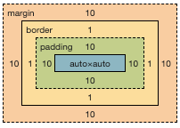

# CSS 基础理论

## CSS 概念

`CSS` 是一种样式表语言。层叠样式表(Cascading Style Sheet)缩写为 `CSS`， 用来描述修饰 html文档标签的渲染呈现方式，是前端`web`的核心语言之一。

### CSS 如何工作运行

1. 浏览器载入 `HTML` 文件（比如从网络上获取）。
2. 将 `HTML` 文件转化成一个 `DOM（Document Object Model）`，`DOM` 是文件在计算机内存中的表现形式，下一节将更加详细的解释 `DOM`。
3. 接下来，浏览器会拉取该 `HTML` 相关资源，比如图片、视频和 `CSS` 样式。
4. 浏览器拉取到 `CSS` 之后会进行解析，根据选择器的不同类型（比如 `element`、`class`、`id`
   等等）把他们分到不同的“桶”中。浏览器基于它找到的不同的选择器，将不同的规则（基于选择器的规则，如元素选择器、类选择器、id 选择器等）应用在对应的 DOM 的节点中，并添加节点依赖的样式（这个中间步骤称为渲染树）。
5. 上述的规则应用于渲染树之后，渲染树会依照应该出现的结构进行布局。
6. 网页展示在屏幕上（这一步被称为着色）。

> 当浏览器遇到无法解析的 `CSS` 选择器或声明的时候,浏览器不会报错，会忽略整个选择器规则，继续解析下一个 `CSS` 样式！

## CSS 选择器

**伪类**是选择器的一种，它用于选择处于特定状态的元素，比如当它们是这一类型的第一个元素时，或者是当鼠标指针悬浮在元素上面的时候。

### 常用的CSS选择器

| 选择器                | 例子                | 例子描述                            |
| ------------------ | ----------------- | ------------------------------- |
| 元素/标签选择器        | p                 | 选择所有\
元素                     |
| 全局选择器             | *                | 所有元素                            |
| 类选择器              | .info             | 选择class="info"的所有元素             |
| ID选择器              | #title           | 选择id="title"的元素                 |
| 同时具有类名            | .name0.name1      | 选择class属性中同时具有"name0""name1"的元素 |
| 类名后代选择器           | .parent .child    | 选择类名parent 后代中所有类名child的元素      |
| 选中符合标签+类名        | p.info            | 选择所有class="info"的\
元素         |
| 同时选中多个标签         | div,p             | 选择所有\
元素和所有\
元素           |
| 元素后代选择器          | div p             | 选择\
元素内所有\
元素             |
| 子代关系选择器         | div>p             | 选择父元素是\
的所有的\
元素          |
| 邻接兄弟               | div+p             | 选择紧跟\
元素的首个\
元素           |
| 通用兄弟              | p~img             | 要选中所有的\
元素后任何地方的\元素          |
| 属性选择器             | a[target]         | 选择带有target属性的所有元素               |
| 属性是否存值选择器        | a[target="_blank"] | 选择带有target="_blank"属性的所有元素     |
| [attribute~=value]    | p[class~="special"] | 选择带有 class="special"且值最少有一个和value匹配的元素     |
| [attr^=value]          | li[class^="box-"] | 匹配带有一个名为attr的属性的元素，其值开头为value子字符串。     |
| [attr$=value]          | li[class$="-box"] | 匹配带有一个名为attr的属性的元素，其值结尾为value子字符串     |
| [attr*=value]         | li[class*="box"] | 匹配带有一个名为attr的属性的元素，其值的字符串中的任何地方，至少出现了一次value子字符串。     |
| 伪元素 ::before        | p::before         | 在每个\
标签内容之前插入内容               |
| 伪元素 ::after         | p::after          | 在每个\
标签之后插入内容                 |
| 伪类 :hover            | p:hover           | 鼠标指针位于元素上时                      |
| 伪类 :focus            | input:focus       | input元素聚焦点时                     |
| 伪类 :active            | a:active       | 在用户激活（例如点击）元素的时候匹配。                    |
| 伪类 :checked            | .radio:checked       | 匹配处于选中状态的单选或者复选框。 |
| 伪类 :disabled            | .input:disabled       | 匹配处于关闭状态的用户界面元素。 |
| 伪类 *:first-child      | article  *:first-child  | 选中所有 article 标签任何第一子元素                |
| 伪类 :first-child       | span:first-child       | 选中其他元素第一子元素为span的元素，如果其他元素第一子元素不是span,那么无效 |
| 伪类 :last-child       | span:last-child       | 选中其他元素最后一个子元素为span的元素，如果其他元素最后一个子元素不是span,那么无效 |
| 伪类 :nth-last-child       | p:nth-last-child(n)       | 匹配一列兄弟元素，从后往前倒数。兄弟元素按照an+b形式的式子进行匹配（比如 2n+1 匹配按照顺序来的最后一个元素，然后往前两个，再往前两个，诸如此类。从后往前数的所有奇数个）。 |
| 伪类 :first-of-type      | li:first-of-type  | 匹配兄弟元素中第一个某种类型的元素。|
| 伪类 :last-of-type      | li:last-of-type  | 匹配某种类型的一列兄弟元素（比如，\
元素），从后往前倒数。兄弟元素按照an+b形式的式子进行匹配（比如 2n+1 匹配按照顺序来的最后一个元素，然后往前两个，再往前两个，诸如此类。从后往前数的所有奇数个）。                     |
| 伪类 :nth-child      | li:nth-child(n)  | 匹配一列兄弟元素中的元素——兄弟元素按照an+b形式的式子进行匹配（比如 2n+1 匹配元素 1、3、5、7 等。即所有的奇数个）。|
| 伪类 :nth-of-type         | li:nth-of-type(even)    |匹配某种类型的一列兄弟元素（比如，\
元素）——兄弟元素按照an+b形式的式子进行匹配（比如 2n+1 匹配元素 1、3、5、7 等。即所有的奇数个）。

### 层叠、优先级、继承

>**层叠** 两条同级别的规则作用在同一个元素时候，后面覆盖前面，实际生效是后面的规则
 
>**优先级** ID(百) > 类(十) > 元素(个)

>**继承** 一些设置在父元素上的 CSS 属性是可以被子元素继承的，有些则不能 哪些属性会被继承
>> 备注： 通用选择器（*）、组合符（+、>、~、' '）和调整优先级的选择器（:where()）不会影响优先级。

| 控制继承属性值  | 例子                | 例子描述                            |
| -----------------   | -----------------   | ------------------------------- |
| inherit           | width:inherit       | 设置该属性会使子元素属性和父元素相同。实际上，就是“开启继承”。|
| initial           | width:initial       | 将应用于选定元素的属性值设置为该属性的初始值。 |
| unset             | width:unset         | 将属性重置为自然值，也就是如果属性是自然继承那么就是 inherit，否则和 initial 一样。 |

| 会被后代元素继承的属性 | 例子               | 
| -------------      | ----------------- 
| color              | ----------------- |
| font-系列属性        | ----------------- |

## 盒模型

### 什么是盒模型？

页面中的每个元素可以看作是一个盒子，元素在页面流实际占用面积以区块形式呈现和布局。
包含以下几部分：margin(外边距)，border(边框)，padding(内边距)，content(元素内容)，
盒模型定义了盒子在页面流中的行为方式以及与其他盒子相互间的关系。

> 标准盒模型：元素实际占用的空间宽为 width + padding + border

> 替代盒模型(怪异盒模型) 某个元素要使用替代模型，可对其设置 box-sizing: border-box;
> 元素实际占用的空间宽为 width，元素内容实际的宽为 width - padding - border

**盒模型在类型上分为两种，外部显示盒模型、内部显示盒模型**

### 外部显示盒模型
以水平方向是否换行分为两种，区块盒子和行内盒子
>区块盒子
> 
> 1. 盒子会产生换行
> 2. `width`和`height`都会起作用
> 3. `margin`，`padding` 和 `border` 都会占用页面空间，'推开'其他元素
> 4. 如果未设定元素 `width`，那么盒子会在横向占满整个块元素的容器，盒子的宽度等于容器宽的100%
>

>行内盒子
>
> 1. 盒子不会产生换行
> 2. `width`和`height`不会再起作用
> 3. 水平方向`margin`，`padding` 和 `border` 会被应用渲染，也会占用页面空间。
> 4. 垂直方向`margin`，`padding` 和 `border` 会被应用渲染，但不会占用页面空间。
>

### 内部显示盒模型
**盒子还有内部显示类型，它决定了盒子内元素的布局方式。通过设置属性 `display:flex;`来更改元素内部显示类型
该元素仍将使用外部显示类型 block 但内部显示类型将变为 flex。该方框的任何直接子项都将成为弹性（flex）项，并按照弹性盒子规范执行。
常用内部显示类型有 弹性布局`flex`，网格布局`grid` 等**

## 层叠层 @layer 块

## CSS的值与单位
**相对长度单位**

| 单位 | 相对于               |
| -------------      | -----------------
| em           | 在 font-size 中使用是相对于父元素的字体大小，在其他属性中使用是相对于自身的字体大小，如 width。 |
| rem          | 跟元素的字体大小 |
| vw        | 视口宽度的 1%。 |
| vh        | 视口高度的 1% |
 

### 媒体查询

### 动画

