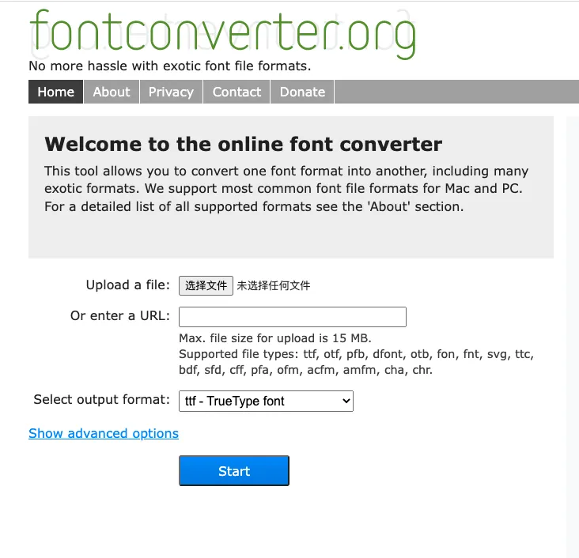
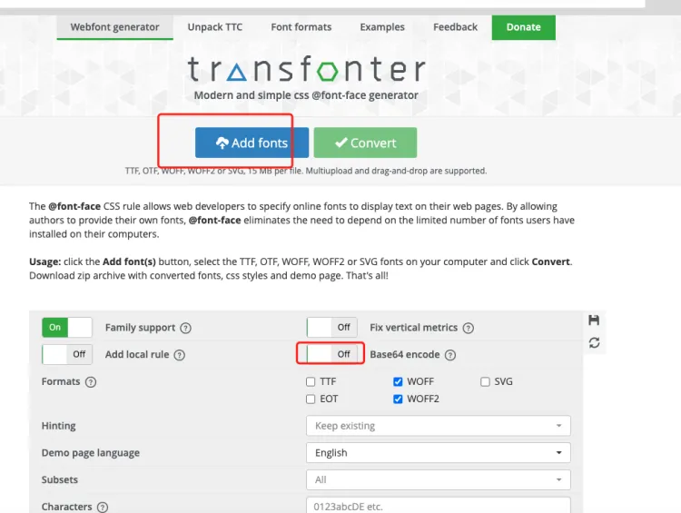

# Css 引入字体样式

### 内部引用

先将字体包转换成需要的格式ttf、eot、svg、woff（最好是ttf文件）字体转换 <https://www.fontconverter.org/>



将字体文件转换成base64 转换地址 <https://transfonter.org/>



将下载得到的stylesheet.css文件拷贝到小程序工程根目录并重新命名，例如din-font.wxss

在小程序app.wxss里面引用字体库的wxss文件 @import "./din-font.wxss";

也可以直接上 base64

```
@font-face {
  font-family: 'DIN Alternate';
  src: url('data:font/woff2;charset=utf-8;base64,d09GMgAB...剩余code') format('woff2'),
    url('data:font/woff;charset=utf-8;base64,d0ANZGLT0...剩余code') format('woff');
  font-weight: bold;
  font-style: normal;
  font-display: swap;
}
```

```
.price{
  font-family: "DIN Alternate";
}
```

### [Specifying local font alternatives](https://developer.mozilla.org/en-US/docs/Web/CSS/@font-face#specifying_local_font_alternatives)

In this example, the user's local copy of "Helvetica Neue Bold" is used; if the user does not have that font installed (both the full font name and the Postscript name are tried), then the downloadable font named "MgOpenModernaBold.ttf" is used instead:

```
@font-face {
  font-family: "MyHelvetica";
  src: local("Helvetica Neue Bold"), local("HelveticaNeue-Bold"),
    url("MgOpenModernaBold.ttf");
  font-weight: bold;
}
```

local("Helvetica Neue Bold")寻找本设备本地字体，未查询到时候，后面的url()会继续被查询到使用。

### 外部引用

```

@font-face {
font-family: 'Din';
src: url('https://domain.com/DIN.ttf') format('truetype');
}
```

```
注意事项
iOS必需使用htpps且不能使用代理地址

域名需要配置白名单

如果放在阿里云oss上面，需要设置允许跨域
```

### MDN文档 [@font-face](https://developer.mozilla.org/en-US/docs/Web/CSS/@font-face)

```
  @font-face {
      font-family: <YourDefineFontName>;
      src: <url> [<format>],[<source> [<format>]], *;
      [font-weight: <weight>];
      [font-style: <style>];
    }
```

font-family： 为载入的字体取名字。

src： [url]加载字体，可以是相对路径，可以是绝对路径，也可以是网络地址。[format]定义的字体的格式，用来帮助浏览器识别。主要取值为：【truetype(.ttf)、opentype（.otf）、truetype-aat、embedded-opentype(.eot)、svg(.svg)、woff(.woff)】。

WOFF

WOFF是Web Open Font Format几个词的首字母简写。这种字体格式专门用于网上，由Mozilla联合其它几大组织共同开发。WOFF字体通常比其它字体加载的要快些，因为使用了OpenType (OTF)和TrueType (TTF)字体里的存储结构和压缩算法。这种字体格式还可以加入元信息和授权信息。这种字体格式有君临天下的趋势，因为所有的现代浏览器都开始支持这种字体格式。

SVG / SVGZ

Scalable Vector Graphics (Font). SVG是一种用矢量图格式改进的字体格式，体积上比矢量图更小，适合在手机设备上使用。

EOT

Embedded Open Type。这是微软创造的字体格式。这种格式只在IE6-IE8里使用。

OTF / TTF OpenType Font 和 TrueType

Font。部分的因为这种格式容易被复制(非法的)，这才催生了WOFF字体格式。然而，OpenType有很多独特的地方，受到很多设计者的喜爱。

font-weight： 定义加粗样式。

font-style： 定义字体样式。
